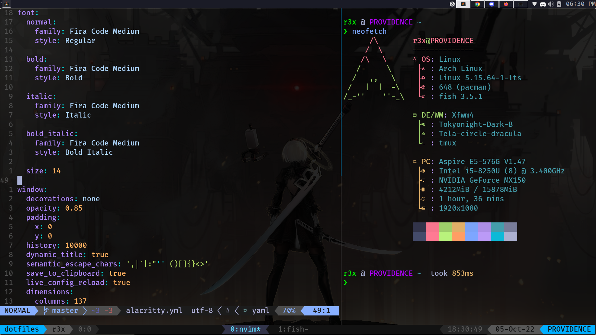

# Dotfiles



- Theme: [Tokyonight-Dark-B](https://www.xfce-look.org/p/1681315/)
- Icon : [Tela-circle-dracula](https://www.xfce-look.org/p/1359276/)

## Installing

You will need `git` and GNU `stow`

Clone into `$HOME` directory

```bash
git clone https://github.com/edr3x/.dotfiles.git 
```

Run `stow` to symlink everything or just select what you want

```bash
stow */  # For Everything
```

```bash
stow nvim # Only nvim config
```
