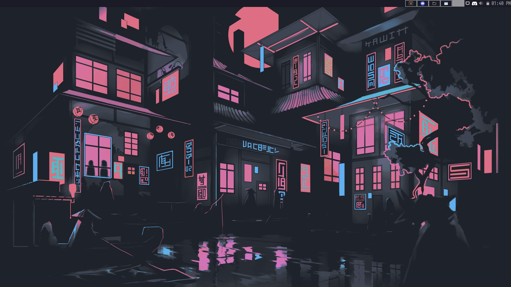
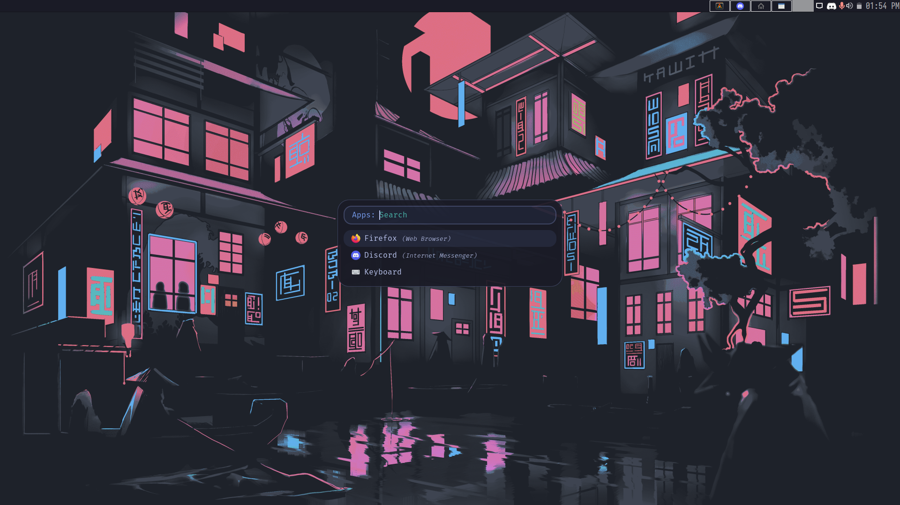
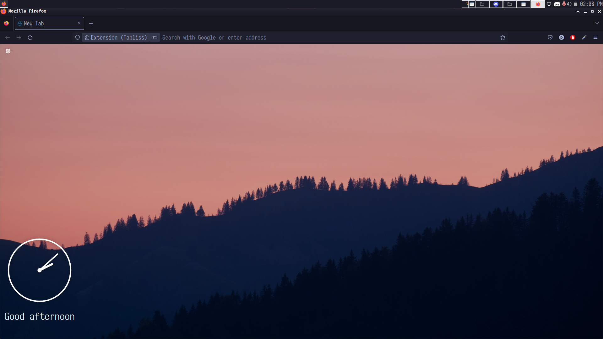
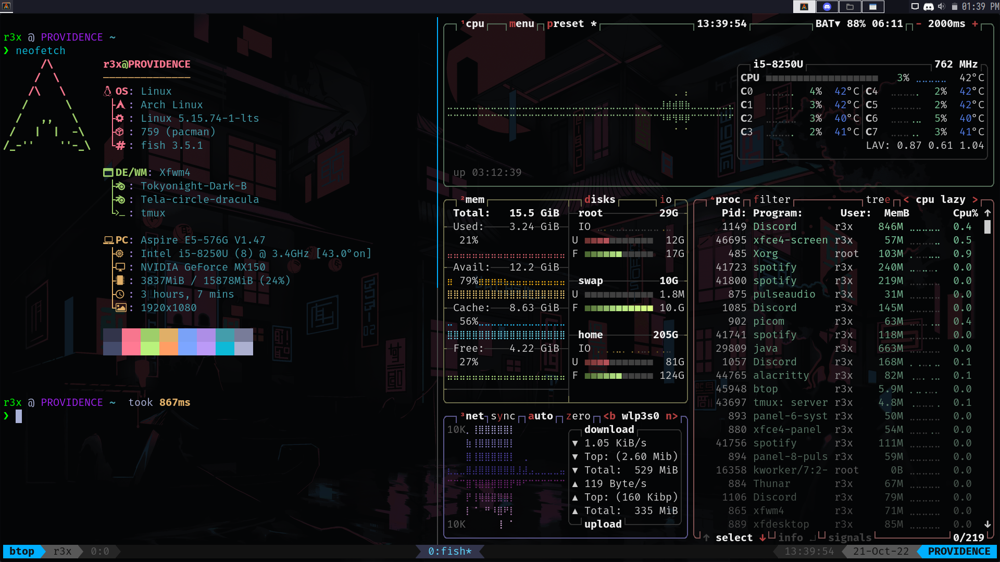
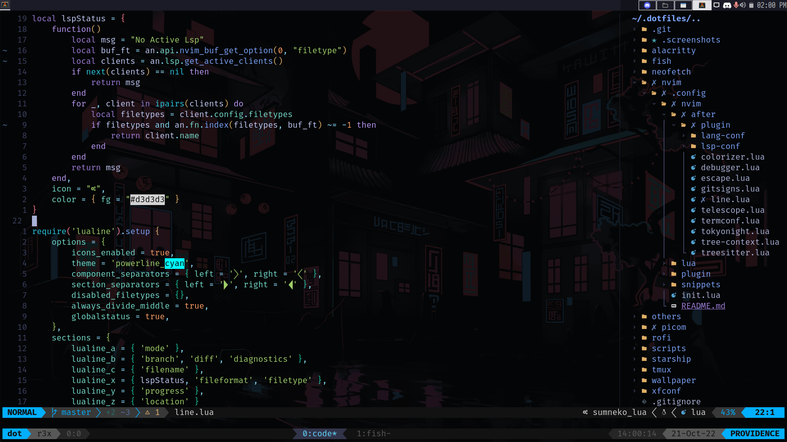

# Dotfiles








- DE : [XFCE4](https://www.xfce.org/)
- Bar : [XFCE bar](https://www.xfce.org/)
- App Launcher : [Rofi](https://github.com/davatorium/rofi/)
- Compositor : [Picom](https://github.com/yshui/picom)
- Terminal :
    - Emulator : [Alacritty](https://alacritty.org/)   
    - Theme : [Modified Tokyonight]()
    - Shell : [Fish](https://fishshell.com/)
    - Prompt : [Starship](https://starship.rs/)
    - Font : [Fira Code](https://www.nerdfonts.com/font-downloads)
- Code Editor : [Neovim](https://neovim.io/)
- Theme : [Tokyonight-Dark-B](https://www.xfce-look.org/p/1681315/)
- System Font : [Iosevka Regular](https://github.com/be5invis/Iosevka)
- Icon Theme : [Tela-circle-dracula](https://www.xfce-look.org/p/1359276/)

## Installing

```bash
sudo pacman -S alacritty fish neofetch neovim picom btop rofi starship tmux
```

You will need `git` and GNU `stow`

Clone into `$HOME` directory

```bash
git clone https://github.com/edr3x/.dotfiles.git 
```

Run `stow` to symlink everything or just select what you want

```bash
stow */  # For Everything
```

```bash
stow nvim # Only nvim config
```
